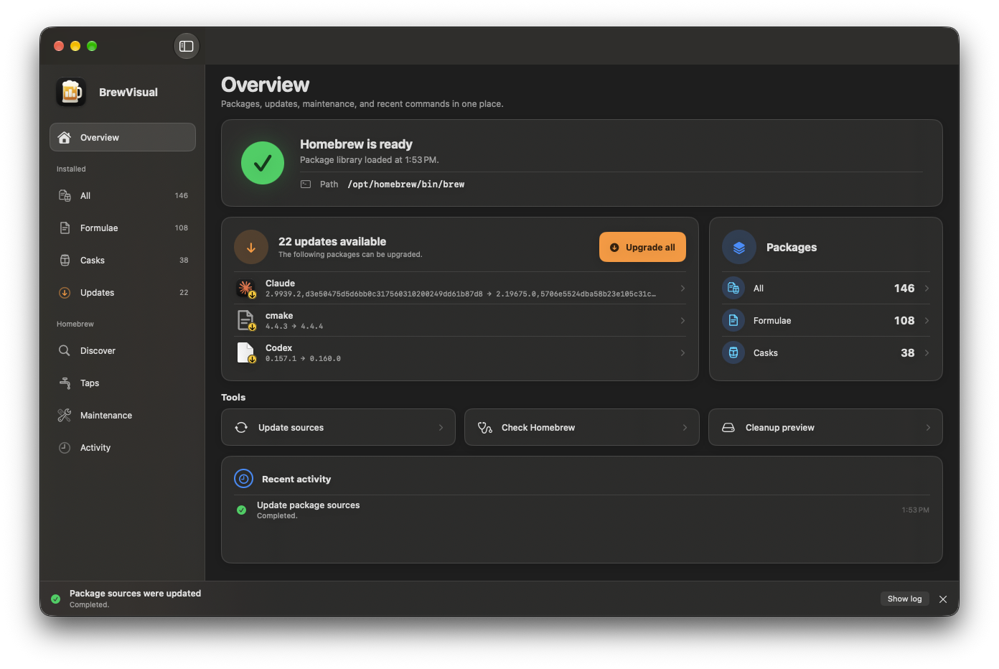
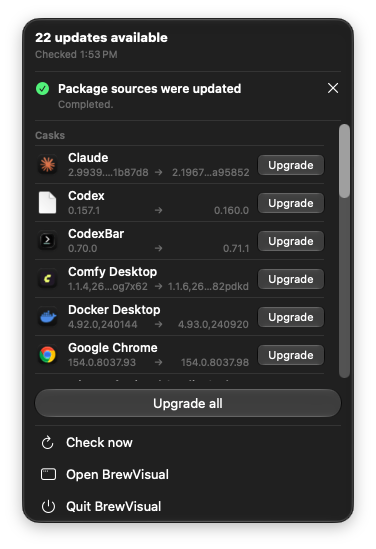

# BrewVisual

A native macOS interface for managing Homebrew formulae, casks, and taps.

BrewVisual is available in English and German. Published downloads are signed with an Apple Developer ID certificate and notarized by Apple.

## Screenshots



*Dashboard in BrewVisual 0.4.0 (German interface).*



*Menu bar update overlay in BrewVisual 0.4.0 (German interface).*

## Features

- Browse installed formulae and casks, discover packages, and manage taps.
- See available updates, library counts, and recent command activity together on the dashboard.
- Install, uninstall, and upgrade packages from the main window.
- View available updates in the menu bar and upgrade an individual package or all available packages.
- Inspect package versions, dependencies, caveats, and project links.
- Follow command and download progress, and review technical output in the command log.
- Run Homebrew diagnostics and preview cleanup candidates before confirming cleanup.

## Requirements

- macOS 27 or later
- Apple Silicon (arm64)
- An existing [Homebrew installation](https://brew.sh)

BrewVisual does not install Homebrew for you.

## Install with Homebrew

```sh
brew install --cask felix-lorenz/tap/brewvisual
```

The [Homebrew tap](https://github.com/felix-lorenz/homebrew-tap) downloads a versioned release archive and verifies its SHA-256 checksum.

## Update BrewVisual

Quit BrewVisual when no Homebrew command is running, then run:

```sh
brew update
brew upgrade --cask felix-lorenz/tap/brewvisual
```

## Direct download

Download the ZIP from the [latest release](https://github.com/felix-lorenz/brewvisual-releases/releases/latest). The release notes include its SHA-256 checksum.

Extract the ZIP and move `BrewVisual.app` to Applications. To update a direct installation, quit BrewVisual and replace the existing app with the app from the latest ZIP.

## Package checks and upgrades

By default, BrewVisual checks for updates at launch and every six hours while it is running. These checks run `brew update` to refresh Homebrew and package metadata; they do not upgrade installed formulae or casks.

You start package installation, removal, and upgrades explicitly. Automatic checks can be disabled in Settings, and **Check now** in the menu bar runs an on-demand check.

## Start at login

On its first launch from Applications, the installed app registers a login item. At login, BrewVisual opens in the menu bar without a main window or Dock icon. You can disable this with **Open BrewVisual at login** in Settings. If macOS requires approval, use **Open Login Items settings** in BrewVisual Settings.

Opening BrewVisual from Finder or Spotlight, or choosing **Open BrewVisual** in the menu bar, shows the main window and Dock icon. After a login launch, closing the main window returns the app to menu-bar-only operation.

## App Management and administrator access

When upgrading a cask, macOS may require App Management permission. BrewVisual checks access when possible and explains how to recover if macOS denies it. Follow the app's guidance to open **System Settings → Privacy & Security → App Management** and enable access for BrewVisual.

If Homebrew needs `sudo` for a protected installation step, BrewVisual presents a secure administrator password prompt. The password is passed only to `sudo`; it is not stored or included in the command log.

## Support

Report bugs or request features through [GitHub Issues](https://github.com/felix-lorenz/brewvisual-releases/issues). Include your BrewVisual, macOS, and Homebrew versions, steps to reproduce the problem, and relevant command output. Remove personal information from screenshots and logs before sharing them.

You can also support BrewVisual's development on [Ko-fi](https://ko-fi.com/felixlorenz). The sidebar's **Support me on Ko-fi** link opens this page in your browser.

## About this repository

This public repository provides product documentation, screenshots, release notes, and distribution archives. The source repository is private.

BrewVisual is an independent app and is not affiliated with or endorsed by the Homebrew project.
